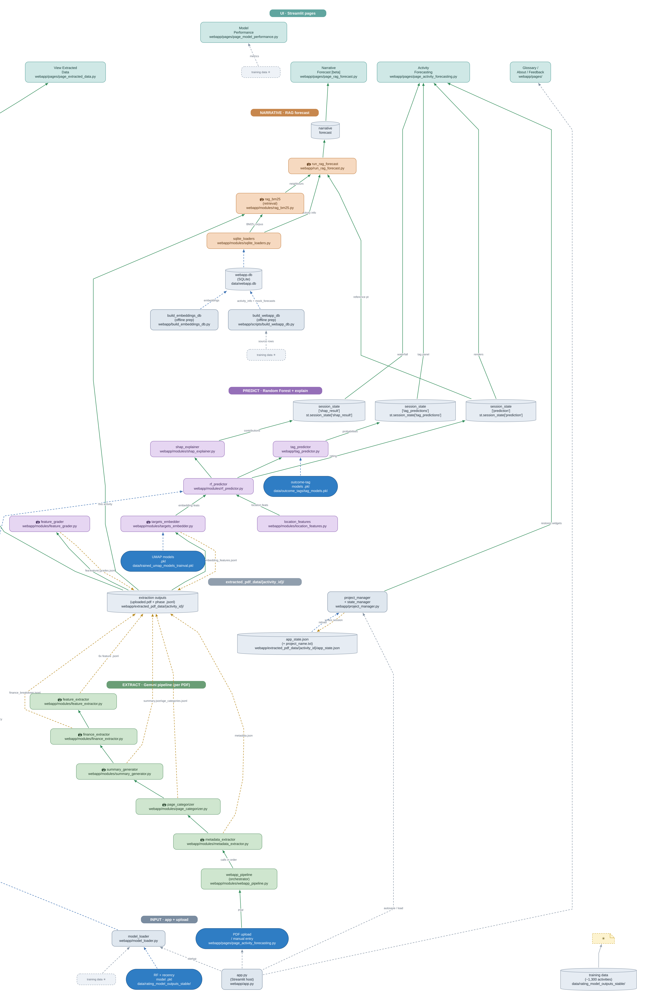

# IATI Activity Success Forecasting

A Streamlit web application that forecasts the likely success rating of international
development activities using evaluation data from the
[International Aid Transparency Initiative (IATI)](https://iatistandard.org/).

Upload a project document (PDF) or enter activity details by hand, and the app extracts
structured features with an LLM, computes document embeddings, predicts a success rating
with a tree-ensemble model, and generates a narrative forecast with LLM commentary.

## The forecasting model

The rating is produced on a **0–5 scale** in three stages:

```
base       = per_org_mode[reporting_org]              # modal rating for the reporting organization
ens_delta  = (rf.predict(x) + et.predict(x)) / 2      # Random Forest + ExtraTrees, target = rating delta
pred       = clip(base + ens_delta, 0.0, 5.0)
pred       = pred + intercept + slope * start_year    # Ridge start-year drift correction
```

- **Per-organization baseline** — the modal historical rating for the activity's reporting
  organization, with an overall fallback.
- **Ensemble delta** — a Random Forest and an ExtraTrees regressor, each trained on the
  residual from the baseline, averaged.
- **Start-year correction** — a single Ridge fit that absorbs linear temporal drift.

Model artifacts live in `data/rating_model_outputs/` and are regenerated from the thesis
forecasting code (see *Regenerating artifacts* below). The application never imports the
research code at runtime; it only consumes the exported artifacts.

## Project layout

```
iati_webapp/
  webapp/                 # Streamlit app, pages, and feature/model modules
  src/                    # vendored LLM / RAG extraction pipeline
  data/                   # runtime data (model artifacts, embeddings DB, tag models)
  Dockerfile              # Render / container build
  requirements.txt
  .streamlit/config.toml
```

`webapp/`, `src/`, and `data/` are siblings so that every relative path resolves the same
way in local development and in deployment.

## Runtime data

| Path | Purpose |
| --- | --- |
| `data/rating_model_outputs/` | Model pickles, feature list, per-org baseline, start-year correction, medians |
| `data/webapp.db` | SQLite store of activity info, mock forecasts, and embeddings |
| `data/outcome_tags/tag_models.pkl` | Outcome-tag classifiers (optional; the app boots without it) |
| `data/postactivity_summaries.jsonl` | Ex-post summaries used by the narrative forecast |
| `data/trained_umap_models_trainval.pkl` | UMAP models for targets embeddings |
| `data/best_model_predictions.csv` | Reference predictions for the RAG prompt |

`tag_models.pkl` exceeds GitHub's 100 MB per-file limit and is not committed; the app boots
without it. Everything else (including `webapp.db`) is committed, so no persistent disk is
required. `DATA_DIR` overrides the data root if you want to point at a different location.

## Local development

```bash
pip install -r requirements.txt
# create a .env with your API keys and APP_PASSWORD (see Configuration below)
streamlit run webapp/app.py
```

Rebuild `data/webapp.db` from the reference JSONL/CSV files only if you have regenerated them:

```bash
python webapp/scripts/build_webapp_db.py
```

By default the app reads from `./data`. Set `DATA_DIR` to override.

## Regenerating model artifacts

The artifacts are exported from the thesis forecasting code so the method stays a single
source of truth:

```bash
python src/pipeline/export_webapp_model.py <output_dir>   # run inside the thesis repo
```

This retrains the Random Forest and ExtraTrees models on all labeled rows, fits the per-org
baseline and start-year correction, and writes `model.pkl`, `extra_model.pkl`,
`feature_names.json`, `train_medians.json`, `per_org_baseline.json`, and
`start_year_correction.json`.

## Configuration

The app reads the following environment variables from `.env`:

- `APP_PASSWORD` — password gate for the app
- `GEMINI_API_KEY` / `GOOGLE_API_KEY` — Google Gemini (feature extraction, embeddings)
- `DEEPSEEK_API_KEY` / `OPENAI_API_KEY` — narrative forecasts
- `TELEGRAM_BOT_TOKEN` / `TELEGRAM_CHAT_ID` — notifications (optional)
- `DATA_DIR` — runtime data directory (defaults to `./data`)

## Organisations covered

UK FCDO · Asian Development Bank · World Bank · BMZ

## Data Flow Diagram

