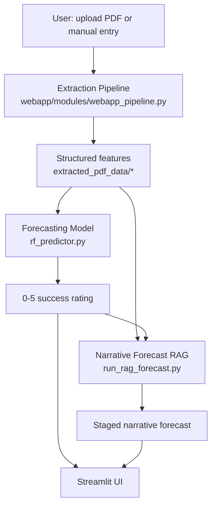

# Architecture

Back to [[Home]].

## Top-level shape

Three sibling directories are kept as siblings so relative paths resolve identically in local dev and on Render:

```
iati_webapp/
  webapp/   Streamlit app: entry point, pages, feature/model modules
  src/      Vendored LLM / RAG extraction pipeline (from the thesis repo)
  data/     Runtime data: model artifacts, SQLite DB, embeddings, tag models
```

The app **never imports the research code at runtime for the model**; it consumes exported artifacts under `data/rating_model_outputs/`. See [[Data and Artifacts]].

## Runtime flow



- [[Extraction Pipeline]] runs Gemini extractions phase by phase, caching each output on disk.
- [[Forecasting Model]] combines a per-org baseline with an RF + ExtraTrees delta and a start-year drift correction.
- [[Narrative Forecast (RAG)]] is a separate, optional multi-stage LLM pipeline that reuses the model prediction as an anchor.

## Entry point

`webapp/app.py`:

- Sets up `sys.path` for `webapp/modules`, `src/extract_structured_database`, `src/utils`, `src/forecast_outcomes` before any local import.
- Loads model + data once via `model_loader.load_model_and_data()` (cached across reruns).
- Renders a custom sidebar (Streamlit's auto nav is hidden via CSS) and dispatches to the page renderers listed in [[UI Pages]].

## Key modules (webapp/modules)

| Module | Role |
| --- | --- |
| `webapp_pipeline.py` | Orchestrates the 5-phase extraction. See [[Extraction Pipeline]]. |
| `metadata_extractor.py`, `page_categorizer.py`, `summary_generator.py`, `finance_extractor.py`, `sector_extractor.py`, `feature_extractor.py` | Per-phase Gemini extractors. |
| `rf_predictor.py` | Builds the feature vector and runs the ensemble. See [[Forecasting Model]]. |
| `shap_explainer.py`, `tree_contributions.py` | Per-prediction explanations shown in the UI. |
| `rag_bm25.py` | Builds RAG synthesis prompts from PDF passages. See [[Narrative Forecast (RAG)]]. |
| `targets_embedder.py` | UMAP embedding features from activity targets. |
| `sqlite_loaders.py` | Lightweight SQLite loaders for reference data. See [[Data and Artifacts]]. |
| `model_loader.py`, `tag_model_loader.py` | Load and cache artifacts at boot. |

## Data flow diagram

The full diagram (built by `build_webapp_drawio.py`):

![[../diagram/webapp_flow_diagram.png]]

Source files in `../diagram/`: `webapp_flow_diagram.drawio`, `.json`, `.svg`, `.png`.
