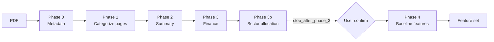

# Extraction Pipeline

Back to [[Home]] · related: [[Forecasting Model]], [[Data and Artifacts]].

Orchestrated by `webapp/modules/webapp_pipeline.py`, function `process_uploaded_pdf()`. Turns one uploaded PDF into the structured features the [[Forecasting Model]] needs. Every phase writes its output to `projects/{activity_id}/` and is skipped on re-run if a valid cached file exists.

## Activity ID and caching

The activity ID is the MD5 hash of the PDF content: `webapp_{hash[:12]}`. Same PDF means same ID means reusable cache. On re-run the orchestrator validates that all required output files exist and are non-empty (and that `page_categories.jsonl` actually has rows) before trusting the cache; otherwise it re-processes.

## Phases

| Phase | Function | Output file(s) |
| --- | --- | --- |
| 0 Metadata | `extract_metadata_from_pdf` | `metadata.json` — title, orgs, locations, dates |
| 1 Categorize pages | `categorize_single_pdf` | `page_categories.jsonl` (+ batch files) |
| 2 Summary | `generate_activity_summary` | `summary.jsonl` (`chatgpt_description`) |
| 3 Finance | `extract_finance_breakdown` | `finance_breakdown.jsonl` |
| 3b Sector allocation | `extract_sector_allocation` / `parse_sector_allocation` | `sector_allocation.jsonl` |
| 4 Baseline features | `extract_baseline_features` | `implementer_performance.jsonl`, `targets.jsonl`, `risks.jsonl`, `context.jsonl`, `finance_qualitative.jsonl`, `misc.jsonl` |

Default model: `gemini-2.5-flash`.

## The confirmation break

`process_uploaded_pdf(..., stop_after_phase_3=True)` runs phases 0–3b, then returns so the UI can let the user review and correct extracted metadata and sector values before the expensive Phase 4 feature grading. The UI resumes with the confirmed values. See `pages/activity_forecasting/upload.py` and `grading.py` in [[UI Pages]].

## Phase 4 output shape

`misc.jsonl` holds structured JSON in `response_text` and is unpacked into `complexity` and `integratedness`. `finance_qualitative.jsonl` maps to the `finance` feature. Other files map to their filename stem. These become the LLM grade inputs to the [[Forecasting Model]].

## Loading cached results

`load_cached_results()` reconstructs the same result dict from disk without any LLM calls, tolerating both the new `response_text` and legacy `response` field names.

## Feature outputs consumed downstream

The qualitative grades (finance, integratedness, implementer_performance, targets, context, risks, complexity) and structured values (finance breakdown, sector allocation) feed the model. Definitions in [[Glossary]].
