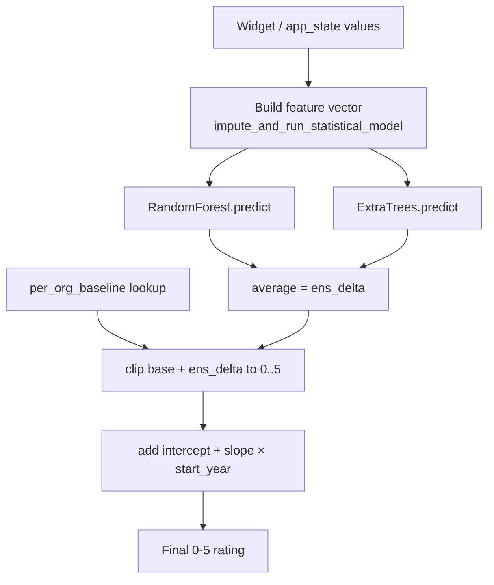

# Forecasting Model

Back to [[Home]] · related: [[Extraction Pipeline]], [[Data and Artifacts]], [[Glossary]].

Produces a success rating on a 0–5 scale in three stages. Implemented in `webapp/modules/rf_predictor.py`; the artifacts it consumes are described in [[Data and Artifacts]].

## The formula

```
base       = per_org_baseline[reporting_org]          # modal historical rating for the org
ens_delta  = (rf.predict(x) + et.predict(x)) / 2       # RF + ExtraTrees, target = rating delta
pred       = clip(base + ens_delta, 0.0, 5.0)
pred       = pred + intercept + slope * start_year      # Ridge start-year drift correction
```

`predict_rating()` is the single source of truth for this formula, shared by the production path and the test suite. `_ensemble_delta()` averages the two regressors; `_active_rep_org_col()` picks the org dummy that selects the baseline, falling back to `__overall__`.



## Three components

1. **Per-organization baseline** — the modal historical rating for the activity's reporting organization, with an `__overall__` fallback. Four reporting orgs are supported (BMZ, FCDO, Asian Development Bank, World Bank), one-hot encoded as `rep_org_0/1/2` with BMZ as the reference category (all three dummies zero).
2. **Ensemble delta** — a Random Forest and an ExtraTrees regressor, each trained on the residual from the baseline, then averaged.
3. **Start-year correction** — a single Ridge fit (`intercept`, `slope`) that absorbs linear temporal drift by activity start year. Default start year is 2020 when unknown.

## Building the feature vector

`impute_and_run_statistical_model()` assembles ~50 features from widget state, location features, embeddings, and sector percentages:

- **LLM grades**: finance, integratedness, implementer_performance, targets, context, risks, complexity (from [[Extraction Pipeline]] Phase 4).
9- **Activity metadata**: activity_scope, finance_is_loan, planned_duration, planned_expenditure (raw USD + log), expenditure_per_year_log, expenditure_x_complexity.
- **Location**: gdp_percap (log), cpia_score, governance_composite, wgi_any_missing, region one-hots (AFE, AFW, EAP, ECA, LAC, MENA, SAS).
- **Embeddings / distances**: umap3_x/y/z, country_distance, sector_distance (see [[Narrative Forecast (RAG)|targets embeddings]]).
- **Sector clusters**: `sector_cluster_*`, sourced from the model artifact so names stay single-sourced with the UI and extractor.
- **Missingness indicators**: `*_missing` flags and completeness ratios.

Any feature not provided falls back to `train_medians`. The code prints loud warnings when an expected feature is missing (median fallback) or when a computed feature is not in `feature_names` (silently dropped). Final ordering matches `feature_names.json`; `NaN`s are filled from train medians.

## Explanations

`shap_explainer.py` and `tree_contributions.py` produce per-feature contributions surfaced on the [[UI Pages|Activity Forecasting]] page so a prediction can be read as baseline plus signed feature effects.

## Regenerating artifacts

Artifacts are exported from the thesis forecasting code so the method stays a single source of truth:

```bash
python src/pipeline/export_webapp_model.py <output_dir>   # run inside the thesis repo
```

This retrains RF and ExtraTrees on all labeled rows, fits the per-org baseline and start-year correction, and writes `model.pkl`, `extra_model.pkl`, `feature_names.json`, `train_medians.json`, `per_org_baseline.json`, `start_year_correction.json`.
