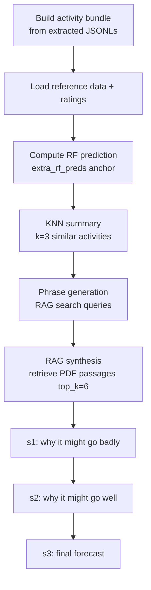

# Narrative Forecast (RAG)

Back to [[Home]] · related: [[Forecasting Model]], [[Extraction Pipeline]], [[Data and Artifacts]].

An optional, separate LLM pipeline (surfaced in the UI as *Narrative Forecast [beta]*). It writes a staged natural-language forecast that reuses the [[Forecasting Model]] prediction as a numeric anchor and retrieves supporting evidence from the uploaded PDF and similar past activities.

Entry point: `webapp/run_rag_forecast.py`, `main(activity_dir_override=...)`. It mirrors the thesis `B_generate_rag_forecasts.py`, reusing `forecast_with_few_shot` (imported as `knn`) but running a single webapp activity end to end.

## How it plugs into the research code

`run_rag_forecast.py` patches the vendored `knn` and `get_similar_activities` modules so their hardcoded relative paths resolve to `data/`, and swaps CSV/JSONL loaders for SQLite loaders when `data/webapp.db` exists (see [[Data and Artifacts]]). The webapp activity is injected as a synthetic row so the few-shot machinery treats it like any labeled activity.

- Similarity backend toggle `USE_VECTOR_KNN`: `False` (default) uses **BM25** over activity summaries — no embeddings file, low RAM. `True` uses Gemini vector embeddings.
- Chosen neighbor IDs are captured during prompt building so the viewer can load their ex-post summaries.

## Stages

| Stage | Purpose |
| --- | --- |
| Bundle | `load_webapp_bundle()` reads summary/context/implementer/targets/risks/finance/misc JSONLs into one dict. |
| Reference data | activity info, ratings, mock (retrospective) forecasts, rating distribution stats. |
| RF prediction | `impute_and_run_statistical_model()` (the [[Forecasting Model]]) provides `extra_rf_preds` as the anchor. |
| KNN summary | Few-shot summary over the `FEWSHOT_K = 3` most similar activities. |
| Phrase generation | Generates search phrases for retrieval. |
| RAG synthesis | `build_synthesis_prompt_from_phrasegen_text()` indexes the uploaded PDF and retrieves `top_k=6` passages (OCR allowed). |
| s1 / s2 / s3 | Staged narrative: risks, upsides, then a final forecast. |

All LLM calls use `deepseek-reasoner`. Outputs are written to `webapp/llm_forecasts/`; RAG indexes persist under `llm_forecasts/rag_indexes/`, PDF text under `llm_forecasts/pdf_txt/`.

## Rating scale

Because a webapp activity has no ground-truth rating, `DEFAULT_RATING_SCALE` supplies a standard 6-option World-Bank-style scale (Highly Unsatisfactory … Highly Satisfactory) so the few-shot prompt builder does not skip it.

## Config

`CFG` sets the variant, tags, and `stages_to_run = [s1, s2, s3]`. `ENSEMBLE_CALLS = 1`. Rendered by `pages/page_rag_forecast.py`.
