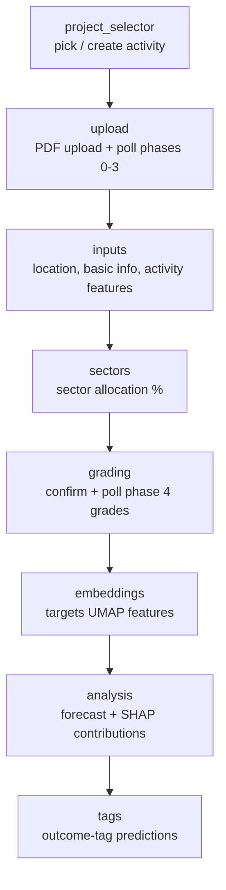

# UI Pages

Back to [[Home]] · related: [[Extraction Pipeline]], [[Forecasting Model]], [[Narrative Forecast (RAG)]].

Streamlit app. `webapp/app.py` hides Streamlit's built-in `pages/` nav and renders a custom sidebar; each entry dispatches to a `render_*` function.

## Pages

| Sidebar entry | Renderer | What it does |
| --- | --- | --- |
| About | `page_about.py` | Project overview and method summary. |
| Activity Forecasting | `page_activity_forecasting.py` | The main workflow: upload/enter, extract, predict. |
| View Extracted Data | `page_extracted_data.py` | Inspect the raw extracted JSONLs for the selected activity. |
| Narrative Forecast [beta] | `page_rag_forecast.py` | Runs / displays the [[Narrative Forecast (RAG)]]. |
| Model Performance | `page_model_performance.py` | Model metrics and training-data views. |
| Glossary | `page_glossary.py` | In-app term reference (see also [[Glossary]]). |
| Feedback | `page_feedback.py` | User feedback form. |

## Activity Forecasting flow

`render_activity_forecasting_page()` composes the `pages/activity_forecasting/` subpackage in order:

- `project_selector.py` — select or create an activity folder.
- `upload.py` — `render_llm_upload_section`, `poll_extraction_phases_0_3` (drives [[Extraction Pipeline]] phases 0–3b, then pauses for confirmation).
- `inputs.py` — location input plus basic-info and activity-feature widgets.
- `sectors.py` — sector allocation percentages.
- `grading.py` — `render_confirm_and_poll_phase4` resumes Phase 4 feature grading after the user confirms.
- `embeddings.py` — targets UMAP features (`umap3_*`, distances).
- `analysis.py` — renders the [[Forecasting Model]] output plus SHAP/tree-contribution explanations.
- `tags.py` — outcome-tag classifier predictions (`tag_predictor.py`, optional model).

State is auto-saved: leaving the Activity Forecasting page triggers `save_project_state_temp()` on the selected project folder (`project_manager.py`, `state_manager.py`).

## Styling note

`app.py` overrides Streamlit's variable font with system fonts to avoid a layout reflow on load, while preserving Material Symbols icon glyphs. Purely cosmetic.
